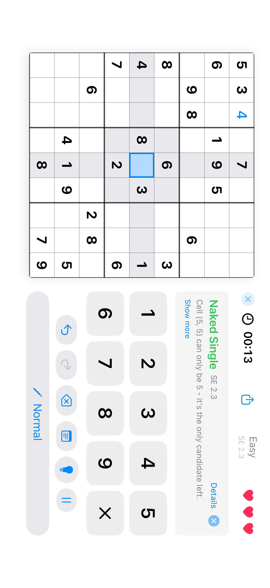

# iOS coverage acceptance — September 15, 2026

The native iOS app now meets the sister repository's 95% line/function standard
and 100% critical gameplay standard. Changes are local on `codex/ios-coverage`.

## Accepted measurement

| Scope | Covered lines | Covered functions |
| --- | ---: | ---: |
| All authored Swift | 5,962 / 6,007 — **99.25%** | 1,205 / 1,245 — **96.79%** |
| GameManager | 301 / 301 — **100%** | 71 / 71 — **100%** |
| GameViewModel | 732 / 732 — **100%** | 181 / 181 — **100%** |

The original five-unit-test baseline measured 6.10% unique source lines and
10.99% mapped functions. The new run includes all 150 unit tests and nine UI
tests; all passed. The 33 coverage collector regression tests also passed.
The baseline and final runs differ in test scope as well as implementation.

The measurement inventories all 32 authored Swift files, excludes generated
UniFFI bindings, and counts overlapping SwiftUI source lines once. It does not
measure Rust coverage or claim Swift branch coverage. Both critical files also
achieved 100% of mapped functions, including their compiler-mapped closures.

## Verified behavior and fixes

- **Gameplay:** manual and automatic notes, erase, undo/redo, original givens,
  saved games, imports, hints/proofs, mistake limits and active play timing.
- **Lifecycle:** background/foreground, terminal recovery, duplicate outcome
  prevention, isolated puzzle history, and preserved notes after relaunch.
- **Interface:** digit entry and hints after rotation; difficulty selection;
  settings persistence/reset; sharing; library/statistics; win/loss actions.
- **Accessibility:** row/column/value/note semantics and stable cell identifiers;
  paused background controls are hidden from accessibility and ignore touches.
  This is automated semantic testing, not a full manual VoiceOver audit.
- **Import:** real Vision fixtures plus deterministic OCR boundaries; inward
  pixel crops prevent transparent edges from misclassifying colored entries.
  Switching to photo review cancels delayed QR delivery.
- **Camera:** permissions, unavailable hardware, capture errors, QR debounce,
  grid tracking, Vision failures, dismissal, resumed capture and stale callbacks.
- **Effects:** timers and delayed effects stop when screens close; small scenes
  avoid invalid firework ranges; sparkle fade-in and repeat row animations work.

## Verified screenshots

Captured from asserted states in the fresh simulator run and visually checked.

### Landscape with digit entry and hints

[Portrait with hints](review-artifacts/ios-2026-09-15/after/gameplay-portrait-with-hint.png),
[manual notes](review-artifacts/ios-2026-09-15/after/manual-notes.png),
[paused](review-artifacts/ios-2026-09-15/after/paused.png),
[completed game](review-artifacts/ios-2026-09-15/after/completed-game.png),
[settings](review-artifacts/ios-2026-09-15/after/settings.png),
[statistics](review-artifacts/ios-2026-09-15/after/statistics.png).

## Reproduce and inspect

Run `./ios/scripts/test-coverage.sh` from the repository root. See
[coverage goals](ios-coverage-goals.md) for thresholds, accounting and CI details.
The helper uses a disposable simulator, fresh profiles, a fresh result bundle,
and a source/test manifest; it preserves artifacts even when a gate fails.

- [Accepted coverage summary](review-artifacts/ios-2026-09-15/after/summary-production.json)
- [Exact app/test source manifest](review-artifacts/ios-2026-09-15/after/source-manifest.json)
- [Zero exit statuses](review-artifacts/ios-2026-09-15/after/acceptance-status.txt)
- Full local bundle: `ios/Sudoku/build/coverage/run.7qiUb9/tests.xcresult`

CI now has a full test/coverage job, report uploads and a TestFlight dependency
on that job. These workflow changes have not been pushed or executed on GitHub.

Physical-camera and live Game Center QA, large accessibility text sizes and a
broader iPad design pass remain outside this acceptance run. Screenshots are
verified evidence of tested states, not an image-baseline regression suite.
